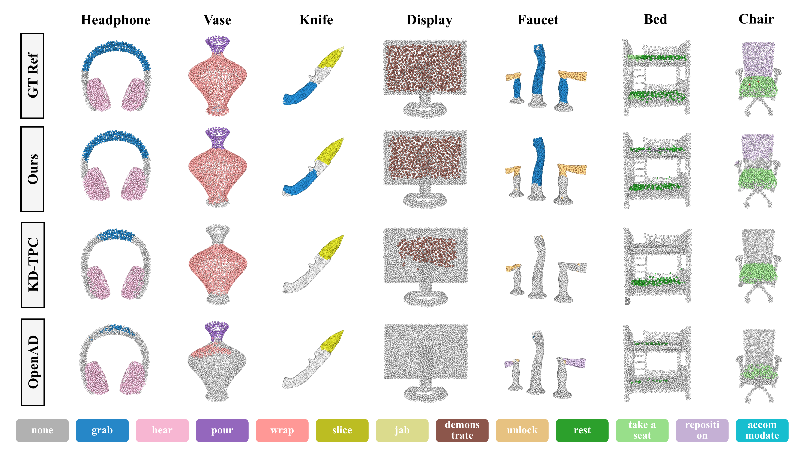
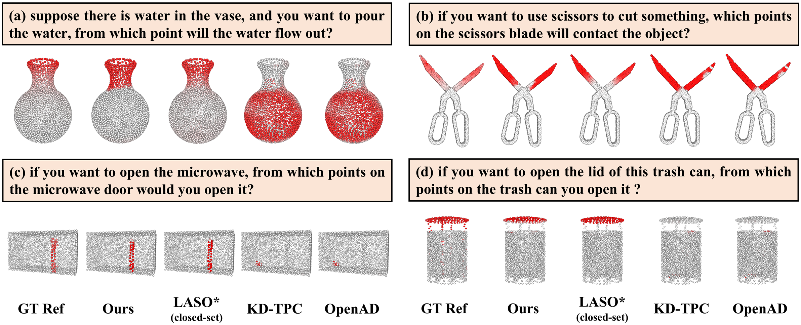

# Open-Vocabulary 3D Affordance Understanding with Functional Text Enhancement

## Abstract
Understanding 3D affordance is essential for agents to effectively interact with real-world environments, encompassing tasks such as manipulation and navigation. Existing methods typically support open-vocabulary queries through label-based language descriptions but often suffer from under-generalization and insufficient discrimination in their representations. However, affordance understanding requires constructing a coherent semantic landscape from fragmented linguistic expressions—one that maintains intra-class diversity while minimizing inter-class overlap. To overcome these challenges, we introduce \textit{Aff3DFunc}, a framework designed to enhance the alignment between affordance and 3D geometry. It begins with a functional text enhancement module grounded in the Information Bottleneck (IB) principle, which strategically enriches affordance semantics by maximizing both relevance and diversity. A dual-encoder architecture is then employed to extract embeddings from both point clouds and text. To bridge the modality gap, we further propose a multilevel representation alignment strategy that incorporates supervised contrastive learning, reinforcing semantic–geometric correspondence in a part-to-whole manner. Extensive experiments demonstrate that our approach significantly enhances the understanding of affordance complexity. The learned representations exhibit high adaptability to diverse text queries, particularly in zero-shot settings. Furthermore, the real-world robot validation confirms that our method improves affordance understanding, enabling more fine-grained manipulation tasks. 

## Framework
The proposed framework *Aff3DFunc* includes: (a) Point Cloud Encoder, extracting geometric features from input point clouds; (b) Text Encoder} where the FTE module enriches affordance semantics via fine-grained descriptions; (c) Representation Alignment, aligning multimodal embeddings with cross-entropy and supervised contrastive losses across multiple levels; (d) Cross Attention, enhancing geometric features via point-wise relationship modeling using Multi-Head Attention.


## Visualization
- Label-as-Affordance-Query

- Quesntion-as-Affordance-Query



## Datasets
- Training and Label-as-Query zero-shot Testing: https://openad2023.github.io/
- Question-as-Query zero-shot Testing: https://github.com/yl3800/laso

## Citiation
```
@inproceedings{aff3dfunc2025,
  title={Open-Vocabulary 3D Affordance Understanding via Functional Text Enhancement and Multilevel Representation Alignment},
  author={Lin Wu, Wei Wei, Peizhuo Yu, Jianglin Lan},
  booktitle={Proceedings of the 33nd ACM International Conference on Multimedia},
  year={2025}
}
```